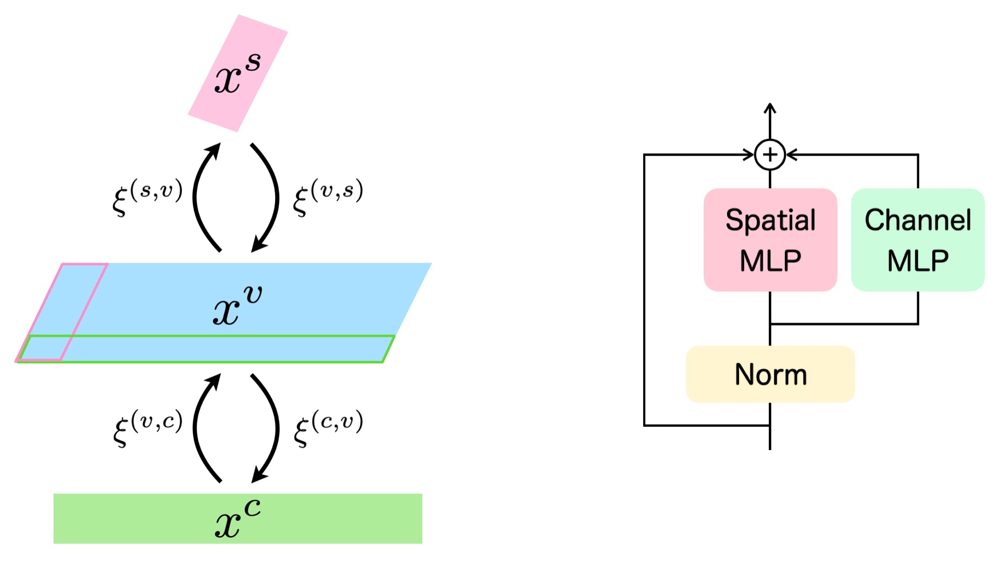

# Hierarchical Associative Memory, Parallelized MLP-Mixer, and Symmetry Breaking

Ryo Karakida, Toshihiro Ota, and Masato Taki<br>
https://arxiv.org/abs/2406.xxxxx

## Abstract

Transformers have established themselves as the leading neural network model in natural language processing and are increasingly foundational in various domains. In vision, the MLP-Mixer model has demonstrated competitive performance, suggesting that attention mechanisms might not be indispensable. Inspired by this, recent research has explored replacing attention modules with other mechanisms, including those described by MetaFormers. However, the theoretical framework for these models remains underdeveloped. This paper proposes a novel perspective by integrating Krotov's hierarchical associative memory with MetaFormers, enabling a comprehensive representation of the entire Transformer block, encompassing token-/channel-mixing modules, layer normalization, and skip connections, as a single Hopfield network. This approach yields a parallelized MLP-Mixer derived from a three-layer Hopfield network, which naturally incorporates symmetric token-/channel-mixing modules and layer normalization. Empirical studies reveal that symmetric interaction matrices in the model hinder performance in image recognition tasks. Introducing symmetry-breaking effects transitions the performance of the symmetric parallelized MLP-Mixer to that of the vanilla MLP-Mixer. This indicates that during standard training, weight matrices of the vanilla MLP-Mixer spontaneously acquire a symmetry-breaking configuration, enhancing their effectiveness. These findings offer insights into the intrinsic properties of Transformers and MLP-Mixers and their theoretical underpinnings, providing a robust framework for future model design and optimization.

## Architecture

The update rule of a three-layer hierarchical Hopfield network (Left) is identified with the mixing layer of our parallelized MLP-Mixer (Right).

<p align="center">
  
</p>

Our single update rule contains all the components of the mixing layer: token- and channel-mixing modules, layer normalization, and skip-connection, unlike previous studies. A model consisting of stacked associative memory models as mixing layers becomes an MLP-Mixer model composed of parallelized token- and channel-mixing modules. For the derivation and more architecture details, see Sec. 5 of [the paper]().

## Usage

### Requirements

We use PyTorch Image Models `timm=0.9.2`. Other dependencies can be installed with the following:

```bash
pip install -r requirements.txt
```

### Training

To train a model, e.g. ParaMixer, on CIFAR-10 from scratch, run the following:

```bash
./distributed_train.sh 4 --data-dir /path/to/cifar10 \
    --dataset torch/cifar10 \
    --num-classes 10 \
    --model paramixer_s16_224 \
    --drop-path 0.1 \
    --epochs 300 \
    --batch-size 96 \
    --lr-base 5e-4 \
    --lr-base-size 512 \
    --lr-base-scale 'linear' \
    --workers 4 \
    --opt adamw \
    --sched cosine \
    --amp \
    --img-size 224 \
    --weight-decay 0.05 \
    --remode pixel \
    --reprob 0.25 \
    --aa rand-m9-mstd0.5-inc1 \
    --smoothing 0.1 \
    --mixup 0.8 \
    --cutmix 1.0 \
    --warmup-lr 1e-6 \
    --warmup-epochs 20
```

### Demo

The numerical demonstrations for Energy MetaFormer (Sec. 4.2) and AsymMixer (Sec. 6.2) are provided in the [demo](./demo) directory

## Citation

If you use our code, or otherwise found our work useful, please cite the accompanying paper:

```bibtex
@article{ota2024paramixer,
  title   = {Hierarchical Associative Memory, Parallelized MLP-Mixer, and Symmetry Breaking},
  author  = {Karakida, Ryo and Ota, Toshihiro and Taki, Masato},
  journal = {arXiv preprint arXiv:2406.xxxxx},
  year    = {2024}
}
```

## License

This project is licensed under the Apache License, Version 2.0 (the "License"). See [LICENSE](./LICENSE) for details.
